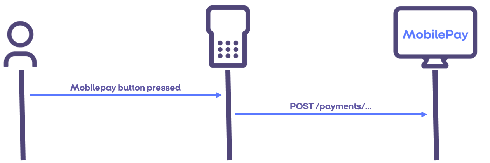
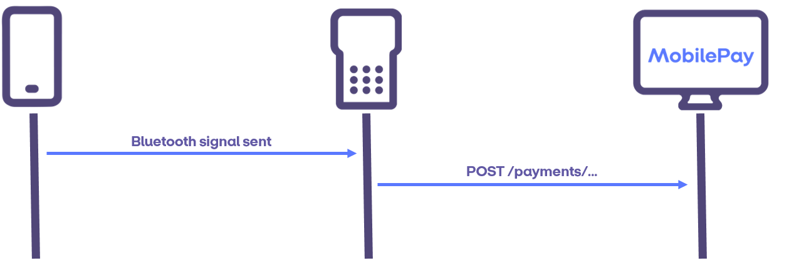

# <a name="detecting_mobilepay"></a> Detecting MobilePay

There are three ways in MobilePay PoS for a terminal/client to become aware that MobilePay has been chosen by the customer as the payment option: User activation, Notification service and BLE 2-way communication.

## <a name="user_activation"></a> User activation

This is the default way of detecting MobilePay presence. In a supermarket, this can be a button on the ECR (Electronic Cash Register) that sends the payment request to MobilePay. For example, the cashier will ask the customer or infer from the customer's actions which payment option the customer wants to choose and then push the MobilePay button. Another example of user activation is when the customer can choose MobilePay herself on a keypad placed on a vending machine for instance. Some vending machines only allow MobilePay to be used and therefore any request for the vending machine product would be inferred as a payment request to MobilePay.

[](assets/images/POD_MobilepayButton.png)

A last example of a user activation is in the case of a QR code being displayed in a terminal. Once the QR code is displayed,
the terminal may start polling an HTTP GET checkin endpoint to determine if a user has checked in. The terminal may only poll
for a check-in while the QR code is displayed on the terminal to ensure the check-in endpoint is not overloaded with requests 
constantly.

[](assets/images/POD_polling.png)


## <a name="ble"></a> BLE 2-way communication

It is possible to get information about check ins via Bluetooth Low Energy - To use this approach the Integrator will need to use one of the MobilePay defined Bluetooth communication protocols.

[](assets/images/POD_BLEsignal.png)


## <a name="notification_service"></a> Notification service

Some interfaces do not naturally include a possibility for user activation - in these cases an endpoint can be exposed by the MobilePay PoS integrator. This endpoint will be called with a check-in Notification when a user checks in. After receiving a notification the client can poll the HTTP GET checkin endpoint for that client.

[](assets/images/POD_BeaconIDRead.png)

# <a name="NotificationService"></a> Notification Service
If your client is unable to detect whether a MobilePay user has checked-in by either [User Activation](Detecting_MobilePay#UserActivation) or [BLE 2-Way](Detecting_MobilePay#BLE2way) you can use our notification service.

To be able to use the notification service, you need to implement an [endpoint](NotificationService#NotificationEndpoint) that MobilePay will send a notification to, when we want you to query the active check-in on a PoS.

When you have implemented the endpoint you need to let us know the URL. You do this by sending an email to developer@mobilepay.com to let us know the URL so our security team can validate and whitelist the URL.

## Callback URL Registration

When the URL is whitelisted, there is two ways of registering the URL on your Point of Sale. [URL Direct](NotificationService#URL_Direct) or [URL by Alias](NotificationService#URL_by_Alias)

### <a name="URL_Direct"></a> URL Direct
When creating your Point-of-Sales using the endpoint **/v10/pointofsales** you have to include a callback that will look like this:

```javascript
"callback": {
  "destination"         : "http://example.com",
  "type"                : "Url"
}
```

This way of providing the URL is the easiest way to get started using the notification service. On the contrary if you imagine that the URL will change in the future then [URL by Alias](NotificationService#URL_by_Alias) is the best way to go.

### <a name="URL_by_Alias"></a> URL by Alias
When you want the possibility of changing the URL, without having to re-create all your active Point of Sales with the new URL, you will have to use this method of providing the URL.

First you will need to send an email to developer@mobilepay.com and request to map your URL to an alias.
Then you can create your Point-of-Sales using the endpoint **/v10/pointofsales** with a callback looking like this:

```javascript
"callback": {
  "destination"         : "AliasForMyURl",
  "type"                : "Alias"
}
```

Now when you have to change the URL you can write to us at developer@mobilepay.com and ask us to whitelist the new URL and afterwards change the mapping from your alias to the new URL. Close collaboration on the time of switching the URL is important to make sure your new endpoint is ready to receive notifications at the time we change the URL of the alias. 

## <a name="NotificationEndpoint"></a> HTTP POST endpoint
The requirements for the endpoint you will have to develop is as follows:

* It must be an HTTPS POST endpoint.
* It must accept a JSON body that has the following format:  

```javascript
{
  "MerchantId"          : "622d3369-f940-4921-93eb-c8fca0c081b4",
  "MerchantBrandId"     : "MPPOS12345",
  "MerchantLocationId"  : "12345",
  "MerchantPosId"       : "MobilePay Merchant Pos Id"
  "PosId"               : "7e6acbde-345e-4641-b2f4-d8df0f3a5147"
}
```
* The format of the fields can be found here: [Input Formats](validation)


