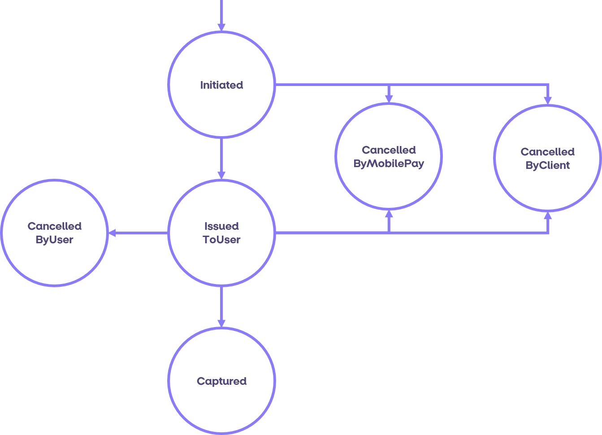

## Payment Flows

The MobilePay PoS system supports two different types of payments: **instant payments** and **reservation payments**. The two payment types differ in whether client approval is required to complete a payment after a user has approved the payment and the payment amount has been reserved. Instant payments are automatically captured without client interaction once the payment amount has been reserved, while reservation payments have to be explicitly captured by the client after the payment amount has been reserved. Reservation payments support both full and partial captures. 

Both payment types can be started in two different ways, depending on whether the payment is immediately ready for user approval or whether further details about the payment are required from the merchant, before it is ready for user approval. In the later case, the payment is initially *prepared* and subsequently marked as *ready* when it is ready for user approval. This yields a total of four possible payments flows:
1. [Instant Payment Flow](payment_flows#instant)
2. [Instant Payment Flow Using Prepare-Ready](payment_flows#instant_prepare)
3. [Reservation Payment Flow](payment_flows#reservation)
4. [Reservation Payment Flow Using Prepare-Ready](payment_flows#reservation_prepare)

The *prepare-ready* variants can for instance be used to start a payment before the payment amount is known. This could for instance be because goods are still being scanned at a cash register or to support [loyalty flows](loyalty).

### Instant Payment Flow

The sequence diagram below shows a sunshine scenario for an instant payment flow. First, a user checks in on a PoS without an active payment in-progress. Then the client *initiates* a new instant payment on that PoS that is immediately ready for user approval and a payment request is immediately sent to the users app for approval. At this point the state of the payment is *IssuedToUser*. Once the user accepts the payment request and the payment amount has been reserved, MobilePay automatically initiates capture and the payment state changes to *Captured* and a receipt is shown in the user's app. 

In the sequence diagram above, the user checked in on the PoS before the payment was created. The sequence diagram below shows an example where the payment is started before the user checks in on the PoS. Until the user is checked in, the state of payment is *Initiated*. After the user is checked in the state changes to *IssuedToUser* and the flow continues as before. 

The diagram below shows all the possible states and transitions for an instant payment without prepare-ready. An instant payment is cancellable by the client until the payment state changes to *Captured*. After a payment has been captured, it can be [refunded](refund), but can no longer be cancelled. A user can cancel an issued payment until they accept the payment.

### Instant Payment Flow Using Prepare-Ready

The sequence diagram below shows a sunshine scenario for an instant payment flow using the prepared-ready functionality. 
A prepared payment starts out in status *Prepared* and remains in the *Prepared* state until the payment is paired with 
a user through a check-in. Once paired, the status changes to *Paired* and querying the payment will also return the users loyalty token, if any. 
Once the payment is ready for user approval, the client marks the payment as ready and provides the payment amount. 
Then the payment is issued to the user and the payment state changes to *IssuedToUser*. 
Once the user accepts the payment request and the payment amount has been reserved, MobilePay automatically 
initiates capture and the payment state changes to *Captured* and a receipt is shown in the user's app. 

### Reservation Payment Flow

The sequence diagram below shows a sunshine scenario for a reservation payment flow. As for instant payments a user can check in after the reservation payment has been initiated but this is not shown here.

### Reservation Payment Flow Using Prepare-Ready

The sequence diagram below shows a sunshine scenario for a reservation payment flow using the prepared-ready functionality. As for instant payments this allows the merchant to set the amount after knowing the user.

