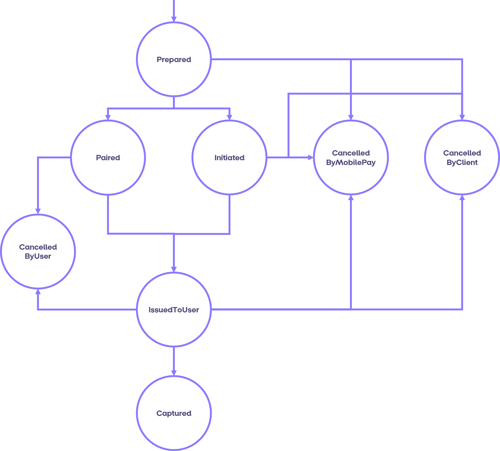
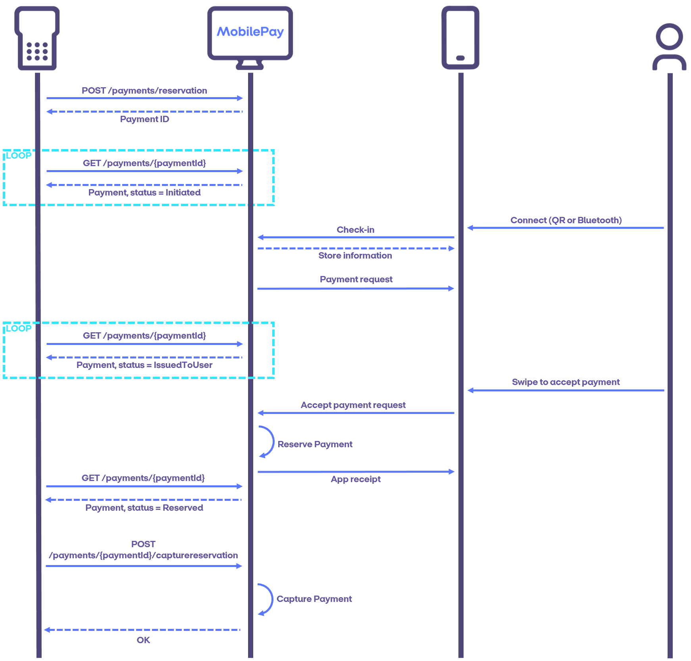
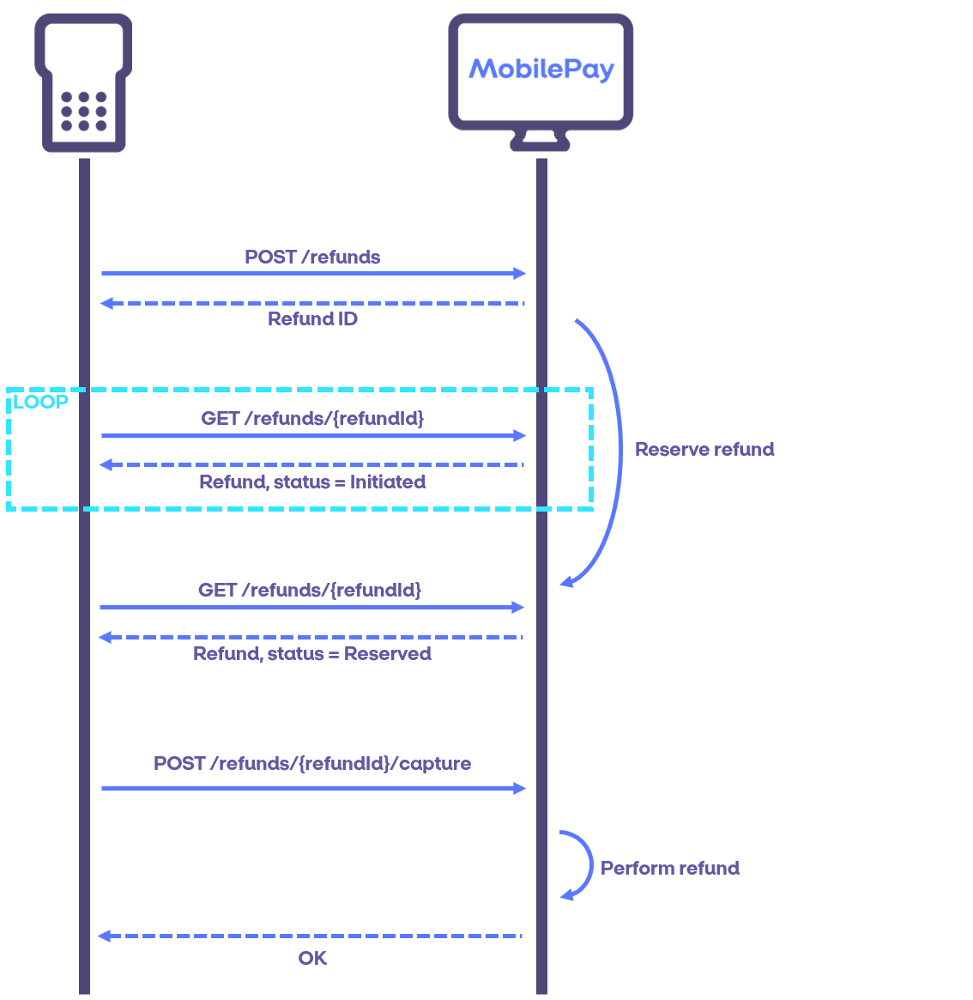
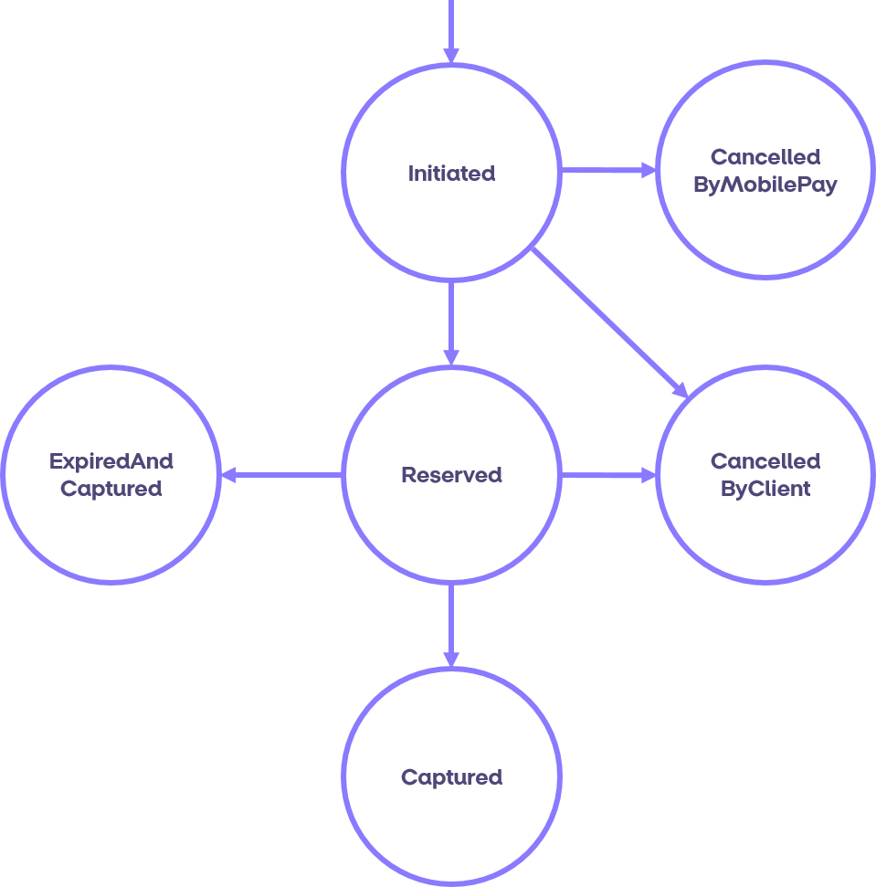
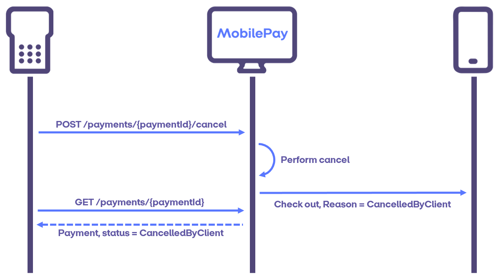
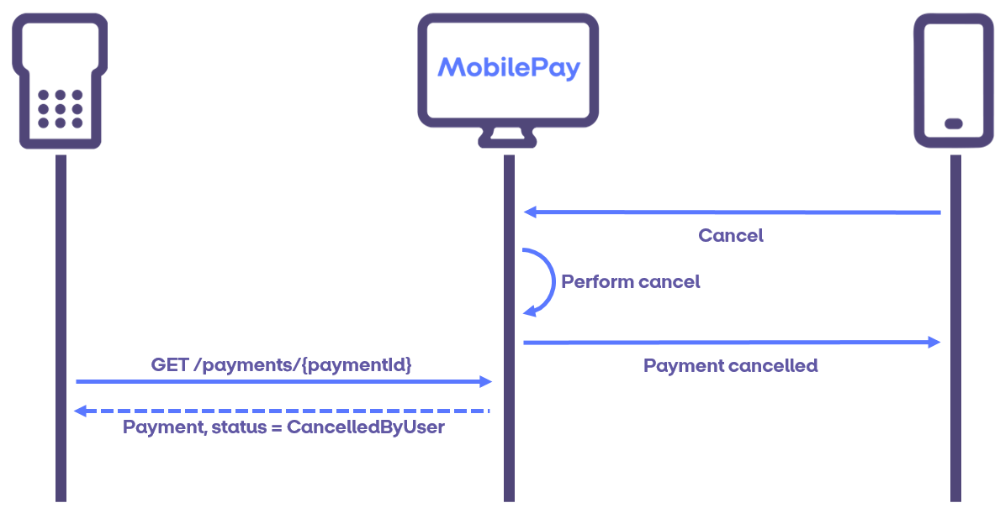

## Payment Flows

The MobilePay PoS system supports two different types of payments: **instant payments** and **reservation payments**. The two payment types differ in whether client approval is required to complete a payment after a user has approved the payment and the payment amount has been reserved. Instant payments are automatically captured without client interaction once the payment amount has been reserved, while reservation payments have to be explicitly captured by the client after the payment amount has been reserved. Reservation payments support both full and partial captures. 

Both payment types can be started in two different ways, depending on whether the payment is immediately ready for user approval or whether further details about the payment are required from the merchant, before it is ready for user approval. In the later case, the payment is initially *prepared* and subsequently marked as *ready* when it is ready for user approval. This yields a total of four possible payments flows:
1. [Instant Payment Flow](payment_flows#instant)
2. [Instant Payment Flow Using Prepare-Ready](payment_flows#instant_prepare)
3. [Reservation Payment Flow](payment_flows#reservation)
4. [Reservation Payment Flow Using Prepare-Ready](payment_flows#reservation_prepare)

The *prepare-ready* variants can for instance be used to start a payment before the payment amount is known. This could for instance be because goods are still being scanned at a cash register or to support [loyalty flows](loyalty).

For a client to start a payment flow - the client first has to detect that a customer is present, ready and willing to pay. In the following descriptions of payment flows it is assumed that the client has already detected a customer. How to detect a MobilePay customer can be read under [Payment Option Detection](Payment_Option_detection). 

### Instant Payment Flow

The sequence diagram below shows a sunshine scenario for an instant payment flow. First, a user checks in on a PoS without an active payment in-progress. Then the client *initiates* a new instant payment on that PoS that is immediately ready for user approval and a payment request is immediately sent to the users app for approval. At this point the state of the payment is *IssuedToUser*. Once the user accepts the payment request and the payment amount has been reserved, MobilePay automatically initiates capture and the payment state changes to *Captured* and a receipt is shown in the user's app. 

In the sequence diagram above, the user checked in on the PoS before the payment was created. The sequence diagram below shows an example where the payment is started before the user checks in on the PoS. Until the user is checked in, the state of payment is *Initiated*. After the user is checked in the state changes to *IssuedToUser* and the flow continues as before. 

##### Payment States for the Instant Payment Flow

The diagram below shows all the possible states and transitions for an instant payment without prepare-ready. 
An instant payment is cancellable by the client until the payment state changes to *Captured*. 
After a payment has been captured, it can be [refunded](payment_flows#refunds), but can no longer be cancelled. 
A user can cancel an issued payment until they accept the payment.

### Instant Payment Flow Using Prepare-Ready

The sequence diagram below shows a sunshine scenario for an instant payment flow using the prepared-ready functionality. 
A prepared payment starts out in status *Prepared* and remains in the *Prepared* state until the payment is paired with 
a user through a check-in. Once paired, the status changes to *Paired* and querying the payment will also return the users loyalty token, if any. 
Once the payment is ready for user approval, the client marks the payment as ready and provides the payment amount. 
Then the payment is issued to the user and the payment state changes to *IssuedToUser*. 
Once the user accepts the payment request and the payment amount has been reserved, MobilePay automatically 
initiates capture and the payment state changes to *Captured* and a receipt is shown in the user's app. 

##### Payment States for the Instant Payment Flow Using Prepare-Ready

The diagram below shows all the possible states and transitions for an instant payment flow using prepare-ready. 
As before, the payment is cancellable by the client and by MobilePay until it has been captured and is cancellable
by the user from the *Paired* and *IssuedToUser* states. 

A prepared payment can be marked as ready for user approval without waiting for a user to be paired with the payment.
In that case the state transitions from *Prepared* to *Initiated* and from there the rest of the flow corresponds to
an instant payment without prepare-ready. 

### Reservation Payment Flow

The sequence diagram below shows a sunshine scenario for a reservation payment flow. The scenario below starts with
a user checking in on the PoS and receiving information about the store. Then the client initiates a reservation
payment on the PoS that is immediately ready for user approval and immediately issed to the user. At that point the
state of the payment is *IssuedToUser* and remains in that state until the user accepts the payment and the payment
amount has been reserved. At that point the state of the payment transitions to *Reserved* and it is up to the client
to *cancel* or *capture* the reservation. Upon calling *capture*, the reservation is captured and the state of the 
payment transitions to *Captured*. 

It is also possible to initiate a reservation payment on a PoS without an active checkin on the PoS, as shown in
the sequence diagram below. In that case
the payment state starts out as *Initiated* and remains in that state until a user is paired with the payment through
a checkin. At that point the payment request is immediately issued to the user and the state of the payment transitions
to *IssuedToUser*. The rest of the flow proceeds in the same way as the scenario above. 

##### Payment States for the Reservation Payment Flow

The diagram below shows all the possible states and transitions for a reservation payment flow without prepare-ready.
A reservation payment can be cancelled by the user until the user has accepted the payment and the payment amount has 
been reserved. After a payment has been captured, it can be [refunded](payment_flows#refunds), but can no longer be cancelled. A
reservation payment can be cancelled by the client until it is captured or *expires*. A reservation payment expires if
it is neither cancelled or captured within the reservation duration specified when the reservation payment is initiated. 
If a reservation payment expires, the state transitions to *ExpiredAndCancelled*. 

### Reservation Payment Flow Using Prepare-Ready

The sequence diagram below shows a sunshine scenario for a reservation payment flow using the prepared-ready functionality. 
A prepared reservation payment starts out in status Prepared and remains in the *Prepared* state until the payment is paired 
with a user through a check-in. Once paired, the status changes to *Paired* and querying the payment will also return the 
user's loyalty token, if any. Once the payment is ready for user approval, the client marks the payment as ready and provides 
the payment amount. Then the payment is issued to the user and the payment state changes to *IssuedToUser*. Once the user 
accepts the payment request and the payment amount has been reserved, the payment state transitions to *Reserved*
and it is up to the client to cancel or capture the reservation. Upon calling capture, the reservation is captured and the 
state of the payment transitions to *Captured*.

##### Payment States for the Reservation Payment Flow Using Prepare-Ready

The diagram below shows all the possible states and transitions for a reservation payment flow with prepare-ready.
A reservation payment can be cancelled by the user until the user has accepted the payment and the payment amount has 
been reserved. After a payment has been captured, it can be [refunded](payment_flows#refunds), but can no longer be cancelled. A
reservation payment can be cancelled by the client until it is captured or *expires*. A reservation payment expires if
it is neither cancelled or captured within the reservation duration specified when the reservation payment is initiated. 
If a reservation payment expires, the state transitions to *ExpiredAndCancelled*. 

###  Refunds

Once a payment is captured, the payment amount is immediately charged from the user. The payment can therefore no
longer be cancelled. Instead, the payment amount can be transferred back to the user, by performing *refunds*. 
Each captured payment can be refunded multiple times with the restriction that the sum of the refunds cannot exceed
the captured payment amount. 
A payment can be refunded up to 30 days after the payment was completed. After 30 days a refund is no longer possible with MobilePay.

The sequence diagram below shows a sunshine scenario for a refund. Initiating a refund yields a *RefundId* that can be
used to query the status of the refund. A refund starts out in the *Initiated* state and transitions to the *Reserved*
state when the refund has been reserved as shown in the state diagram below. Once a refund has been reserved, the client 
can choose to capture the refund,transitioning the state to *Captured*. When a refund is captured, the refunded amount 
is immediately transferred to the user and the user is notified of the refund. 

Until the refund has been captured, the client can also choose to cancel the refund.
The diagram below showes the possible states and transitions for a refund.

###  Cancel Flows

The V10 API supports cancelling of payments and refunds.

A payment is cancellable by the client until the state has changed to *Captured* or *ExpiredAndCancelled*. Furthermore, a payment can be cancelled by the user when the payment is in state *Paired* or *IssuedToUser*. 
Payments can be cancelled by calling the endpoint **/v10/payments/{paymentId}/cancel**. It requires the payment id of the payment to be cancelled. When the payment has been cancelled the state transitions to *CancelledByClient*. 
If the user cancels the payment the state will transition to *CancelledByUser*.

A refund is cancellable until it reaches the state *Captured* or *ExpiredAndCancelled*. Refunds can only be cancelled by the client since there is no user involved in the process. A refund can be cancelled by calling the endpoint **/v10/refunds/{refundId}/cancel**. It requires the id of the refund that was returned when the refund was initiated.
When the refund has been cancelled the state transitions to *CancelledByClient*. 

The diagrams below show the sunshine scenarios for a payment cancelled by the client and a payment cancelled by the user.
When the client cancels the payment a notification is sent to the app sending the user back to the pay screen with a message saying that the payment was cancelled by the shop.

When the user cancels the payment the app will show a message saying that the payment was cancelled. The status of the payment when queried will be *CancelledByUser*.

The cancel funtionality can also be used in case of non-sunshine scenarios. It could be if the call to initiate a payment is faulty or if the client never receives the response. In this case the client should either retry the call (as described in [Error Handling](api_principles#error_handling) or the client could try to get the payment id by the order id and cancel afterwards.
