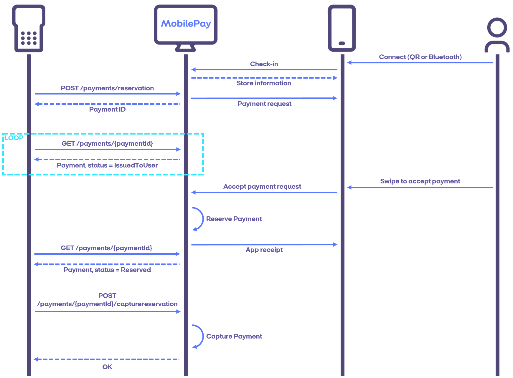
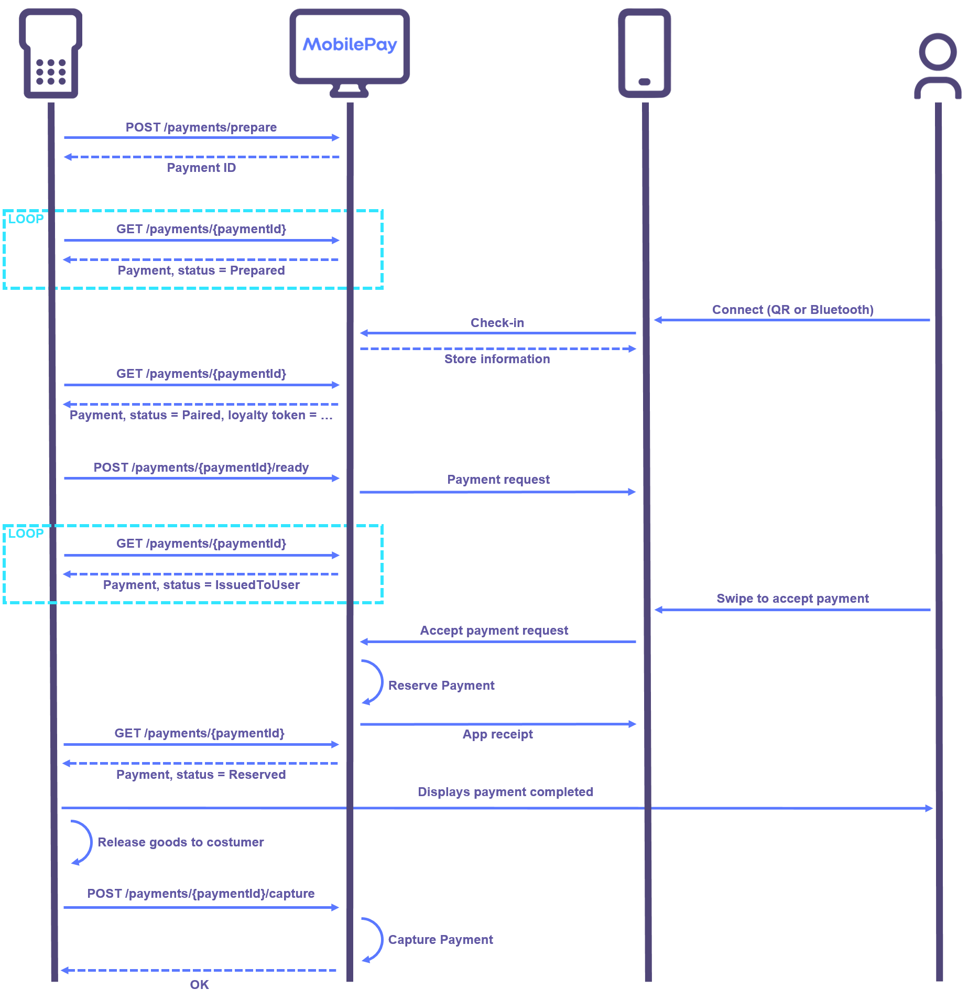

## Payment Flows

Our system supports two different types of payments: Instant and reservations. An instant payment does not require approval from the merchant to complete the payment, after the user has approved the payment. When the user has approved, the payment is done and no further action is needed. A reservation needs approval from the merchant in the sense that they will have to call the capture endpoint in order to finish the payment. The API supports both full and partial captures.

The sequence diagrams below show the two different flows. Reaching the state where a payment is initiated can be done in two different ways:
1.	Directly using either /v10/payments/instant or /v10/payments/reservation
2.	In two steps using either /v10/payments/instant/prepare /v10/payments/reservation/prepare followed by the ready endpoint /v10/payments/{paymentId}/ready

For regular payments, best practice is to use option 1.
Option 2 is intended for cases where you do not want to specify the amount on the payment before the user is checked in and locked on the payment. This could be in the case of loyalty payments where the merchant might want to reduce the amount to be paid after knowing what type of loyalty card the user has. 

The API supports cancelling of payments. A payment can only be cancelled before it has been captured. Either by Mobilepay (Instant payments) or by the merchant (Reservation payments).

The system supports checking in either before or after the payment has been initiated. 

### Instant Payment Flow

The sequence diagram below shows the sunshine flow for Instant payments where the user is checked-in before the payment has been initiated. When that state of the payment reaches Captured the payment is done and the PoS is ready for the next user to check in or the next payment to be initiated.

The sequence diagram below shows the sunshine flow for Instant payments where the payment is initiated and the user checks in afterwards.

### Instant Payment Flow Using Prepare-Ready

The sequence diagram below shows the sunshine flow for Instant payments using the prepared-ready functionality. The intended use of this functionality is to let the user check-in after the payment has been prepared but before calling the ready endpoint. This will lock the user to the payment and allow the merchant to set the amount after knowing the user.

### Reservation Payment Flow

The sequence diagram below shows the sunshine flow for a Reservation payment. As for Instant payments a user can check in after the Reservation payment has been initiated but this is not shown here.

### Reservation Payment Flow Using Prepare-Ready

The sequence diagram below shows the sunshine flow for Instant payments using the prepared-ready functionality. As for Instant payments this allows the merchant to set the amount after knowing the user.

