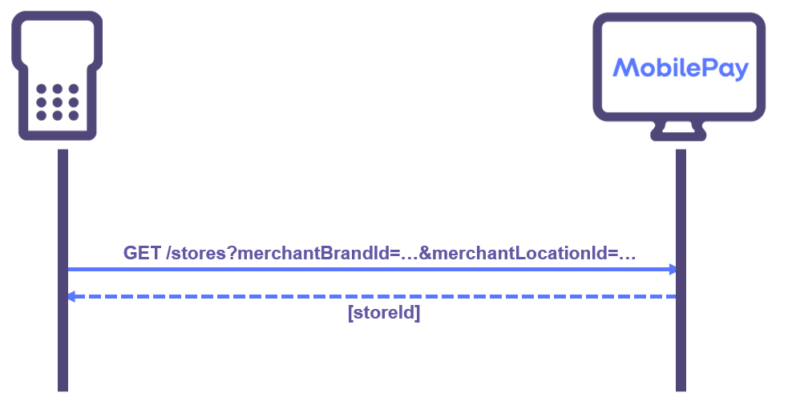
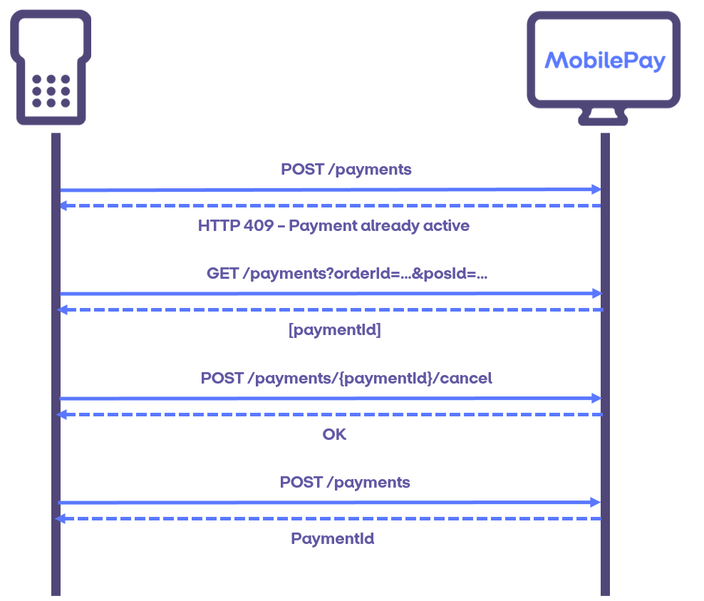
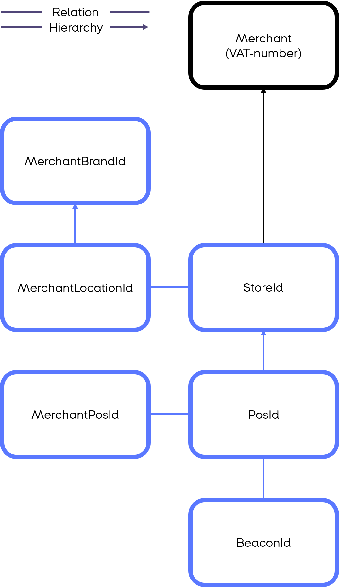

## <a name="pos_management"></a>Point-of-Sale Management
The point-of-sale (*PoS*) represents the contact point between a MobilePay user and the merchant.
To initiate a MobilePay payment it is necessary to first create a PoS. 

### Onboarding

Each PoS belongs to a *Store* which in turn belongs to a *Brand*. A brand can be thought of as a combination of a name and a logo. When a MobilePay user checks-in on a PoS they will see the brand name and the logo in the app, which helps the MobilePay user confirm that they have in fact checked in where they intended. An example of a brand could be 7-Eleven in Denmark or K-Market in Finland. A brand is identified by a ````merchantBrandId````. Each brand consists of one or more stores. Each store also has a name which is also shown to the MobilePay user when they check-in on a PoS that belongs to that store. A ````merchantLocationId```` together with a merchantBrandId identifies a store within a brand. 

Brands and stores are created by the merchant when onboarding with MobilePay PoS and the merchant will typically provide the ````merchantBrandId````s and ````merchantLocationId````s for the merchant's brands and stores to the integrator. 

When the integrator has received the ````merchantBrandId```` and the ````merchantLocationId```` they will have to call ````GET /api/v10/stores```` with the two ids, and in return they will receive a ````storeId```` which will be used to create all the PoS'es on that store. The ````storeId```` will therefore have to be persisted in an application configuration file for subsequent calls to the V10 API. Here is a flow for getting the storeId using ````GET /api/v10/stores````:
[](assets/images/get_store.png)

### PoS Creation

#### Beacons
The first thing to consider when creating PoSes is what beacon(s) will be used to connect MobilePay users to the given PoS.
This can range from an unmanned vending machine that has no payment hardware at all and hence only shows a QR code on a screen, to a full fledged super market ECR with a 2-way bluetooth capable terminal that also can show a QR code. To create a PoS, the client needs to provide a list of possible ways to detect the PoS. The more accurate the list is, the better MobilePay will be able to detect errors (if bluetooth is provided as a beacon type but we detect that no user ever checks-in via bluetooth something is likely wrong). It is recommended to keep the list of supported beacon types in an application configuration and then edit the list in case the setup changes.

Each beacon, whether through a MobilePay QR code or a bluetooth/NFC signal, encodes a ````beaconId```` that can be read by the MobilePay app. It is ````beaconId```` that is used to connect a MobilePay user to a specific PoS. ````beaconId````s are globally unique across all merchants in MobilePay PoS and each ````beaconId```` can refer to at most one active PoS at any given time. 

Depending on the client setup, here are different use cases for handling ````beaconId````s in API V10

##### Client only supports QR codes and can create and show it on a screen
In case the client only allows QR beacons (no physical device) and can create a QR code dynamicaly (i.e generate a QR code and show it on a screen in opposition to printing a physical QR code), then the client can choose to let MobilePay create a GUID to use as ````beaconId````. The client then omits to provide a ````beaconId```` on PoS creation and afterwards queries the PoS to get the ````beaconId````. The client can then store the ````beaconId```` in memory for QR code generation. Everytime the client reboots the client then has to query the PoS and grab the ````beaconId````. This way the client is not required to store a ````beaconId```` in a configuration file since they can rely on querying it dynamically.

##### Client only supports QR codes and depends on printed QR codes
In case the client only allows QR beacons but is not able to generate a QR code dynamically, the client will have to create a guid and provide that as the ````beaconId```` on PoS creation. The ````beaconId```` should then be stored locally in a configuration file so that it can be used if the PoS needs to be updated (i.e. deleted and re-created. See [PoS Updating and Deletion](pos_management#pos_updating_deletion))
It is best practice to use a GUID as the ````beaconId```` to avoid ````beaconId```` clashes and to eliminate risk that the ````beaconId```` will be stolen by another client in between the call to Delete and the call to re-create.

##### Client supports physical devices (terminals, MobilePay white boxes)
In cases where the client will use a physical device then that device will have a MobilePay ````beaconId```` associated with it. On PoS creation this ````beaconId```` has to be provided. Some devices allows a client to read the ````beaconId```` from it. If that is the case we recommend to read the ````beaconId```` when the client reboots and query the PoS to see if the ````beaconId````s match. If not delete the PoS and re-create it with the new ````beaconId````. This will make it possible to replace the device if its broken, and only have to reboot the system to propagate the changes.
If reading the ````beaconId```` from the device is not possible, we recommend to store the ````beaconId```` locally in a configuration file so that it persists through reboots.

#### <a name="callback"></a>Callback
If the client system cannot detect when a MobilePay user wants to pay and therefore needs to use the [Notification service](detecting_mobilePay#notification_service), the client should set the callback parameter accordingly when calling ````POST /api/v10/pointofsales````.
It is recommended to store the callback alias in the config file of the application.

#### Naming
The last thing to keep in mind when creating PoSes is to consider the name. When a MobilePay user checks in on the PoS they will in the app see, in sequence: The name of the brand, the name of the store and the name of the PoS. We recommend naming the PoS so that the MobilePay user can verify that they in fact have checked in the right place. So in a supermarket scenario a good name for the PoS would be "Check-out 1" for the first check-out counter in that supermarket.

Here is a flow to showcase creation of a PoS with ````POST /api/v10/pointofsales````:
[](assets/images/pos_creation.png)

### <a name="pos_updating_deletion"></a>PoS Updating and Deletion
We recommend only deleting a PoS if it is either not going to be used anymore, or you need to update it to reflect changes like a new callback alias, new name, new ````beaconId```` etc.

When a PoS is deleted it is no longer possible to issue payments. However it will still be possible to capture or cancel payments that are in the reserved state. It is best practice to delay the deletion of a PoS until all payments have either been cancelled or captured.

To delete a PoS you will have to call ````DELETE /api/v10/pointofsales/{posId}````

Here is a flow diagram to showcase a successfull delete:
[](assets/images/pos_deletion.png)

### Keeping in sync with MobilePay

#### When PoS reboots
When the client reboots it is good practice to query the PoS with ````GET /api/v10/pointofsales```` with the merchantPosId and persist the posId in memory to use for initiating payments. If no PoS is returned, the client will have to re-create it. Here is the flow described:
[](assets/images/PoS_Onboarding.png)


We recommend the client to store the following in a configuration file to be able to create the PoS when needed:

* StoreId
* MerchantPosId
* Name of PoS
* BeaconId (unless it can be read from the device itself. See [Beacon Id's](pos_management#beacon_ids) )
* Callback (If the client is dependent on the notification service. See [Callback](pos_management#callback))
* Supported beacon types

#### When initiating payment
A client might try to initiate a payment even though a payment is already on-going. For instance, this might happen if the client has experienced a crash and did not finish the previous payment flow gracefully. To combat this possible scenario it is best practice to be prepared for an ongoing payment and cancel it like this flow:
[](assets/images/initiate_payment_error_active_payment.png)

#### Once in a while
The client is responsible for persisting if a reserved payment should be cancelled or captured. In case the client gets a timeout (or other errors resulting in failed calls) trying to either call Capture or Cancel on a payment, it is crucial that they persist whether the payment should be captured or cancelled so they can try again later.

It is required of the client to implement a periodically scheduled job of running through all their payments left in reserved state, and try to either cancel or capture it. The flow would look like this:
[](assets/images/capture_cancel_hanging_reservations.png)

### <a name="master-data"></a>Master Data
DELETE THIS SECTION INCLUDING DATA HIERARCHY?

A store is uniquely defined by the combination of MerchantBrandId and MerchantLocationId. Two stores with the same MerchantLocationId but different MerchantBrandIds are not related in any way. The MerchantBrandId, MerchantLocationId and StoreId are supplied by MobilePay when the Merchant/Store is onboarded. 

[](assets/images/Master_Data_Hierarchy.png)
