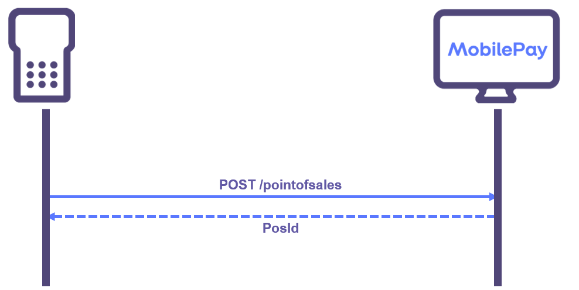
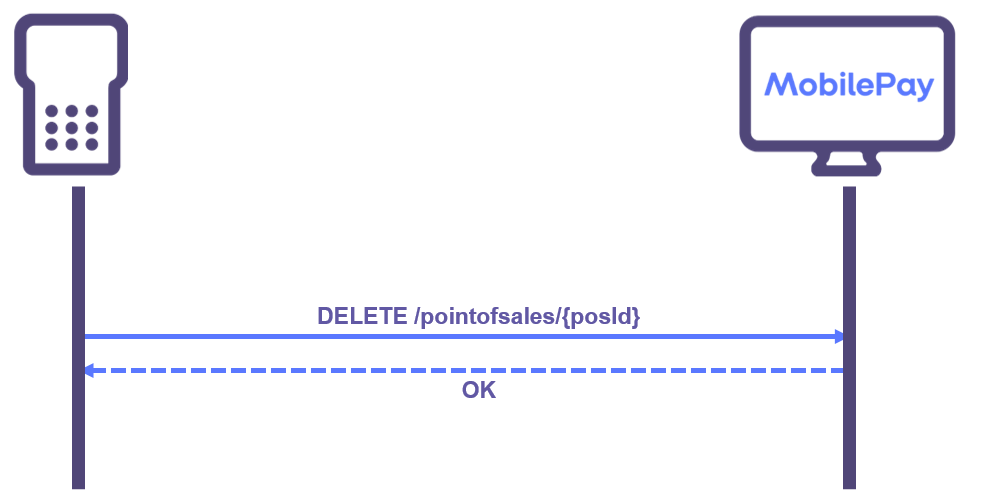
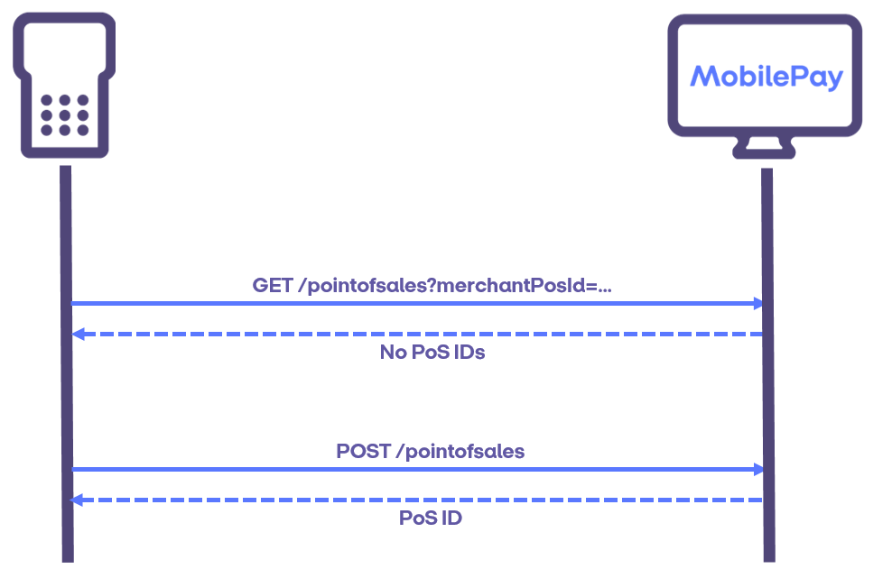
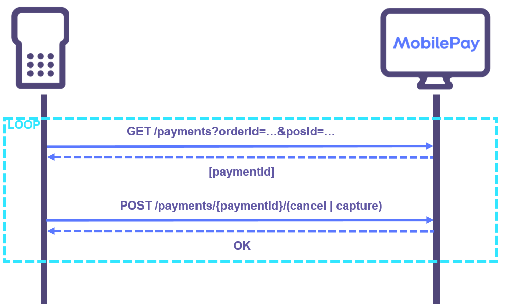

## Point-of-Sale Management
The point-of-sale (reffered to as 'PoS' from this point on) represents the contact-point between a MobilePay user and the merchant.
So to get started making MobilePay payments the first thing to do is to create a PoS.

### Onboarding
Before the client can even start creating PoS'es, the integrator needs to ask the merchants for some information. First of all they will need one or more merchantBrandId's and a list of merchantLocationId's (one merchantLocationId pr. store) that they need the client to handle.

The merchantBrandId identifies a brand which for simplicity can be thought of as a name and a logo. When a MobilePay user checks-in on a PoS they will see the brand name and the logo in the app, which helps the MobilePay user to confirm that they have in fact checked in where they intended. An example of a brand could be 7-Eleven in Denmark or K-Market in Finland.

The merchantLocationId together with the merchantBrandId identifies a store within that brand. Each store has a name which also will be shown to the MobilePay user when they check-in on a PoS that belongs to that store.

The merchant creates their brand and store when onboarding MobilePay and they have to provide their integrator with the id's of the two entities so that the integrator's client can manage PoS'es on the merchants behalf.

When the integrator has received the merchantBrandId and the merchantLocationId they will have to call *GET /api/v10/stores* with the two ids and in return they will receive a storeId which will be used to create all the PoS'es on that store. The storeId will therefore have to be persisted in an application configuration file for subsequent calls to the V10 API.

### PoS Creation

#### Beacon Types
The first thing to consider is what [beacon types](validation#poses) that will be supported by the client.
It can range from an unmanned vending machine that has no hardware at all and hence only show a QR code on a screen to a full fledged super market ECR with a 2-way bluetooth capable terminal that also can show a QR code. To create a Pos the client needs to provide a list of possible ways to detect the PoS. The more accurate the list is, the better MobilePay will be able to detect eventual errors (if bluetooth is provided as a beacon type but we can see no one ever checks-in by bluetooth something is likely wrong). It is recommended to keep the list of supported beacon types in an application configuration and then only edit the list in case the setup changes.

#### Beacon Id's
In case the client only allows QR beacons (no physical device) and can create a QR code dynamicaly (i.e generate a QR code and show it on a screen in opposition to print a physical QR code), then the client can choose to let MobilePay create a random guid to use as beaconId. The client then omits to provide a beaconId on PoS creation and afterwards query the PoS to get the beaconId. The client can then store the beaconId in memory for QR code generation. Everytime the client reboots the client then has to query the PoS and grab the beaconId.

In case the client only allows QR beacons but is not able to generate a QR code dynamically, they will have to create a guid themselves and provide that as beaconId on PoS creation. The beaconId will then have to be stored locally in a configuration file so that it can be used if the PoS needs to be updated (i.e. deleted and re-created. See [PoS Updating and Deletion](pos_management#pos_updating_deletion))
It is best practice to use a true random Guid to avoid Guid clashes and to eliminate risk that the beaconId will be stolen by another client in between the call to Delete and the call to re-create.

In cases where the client will use a psysical device then that device will have a MobilePay beaconId associated with it. On PoS creation this beaconId has to be provided. Some devices allows a client to read the beaconId from it. If that is the case we recommend to read the beaconId when the client reboots and query the PoS to see if the beaconIds match. If not delete the PoS and re-create it with the new beaconId. This will make it possible to replace the device if its broken, and only have to reboot the system to propagate the changes.
If reading the beaconId from the device is not possible, we recommend to store the beaconId locally in a configuration file so that it persists through reboots.

#### Callback
If the client system cannot detect when a MobilePay user wants to pay and therefore needs to use the [Notification service](detecting_mobilePay#notification_service), you will have to set the callback parameter accordingly when calling *POST /api/v10/pointofsales*.
It is recommended to store the callback alias in the config file of the application.

#### Naming
The last thing to keep in mind before creating the PoS is to consider the name. When a MobilePay user checks in on the PoS they will in the app see, in sequence: The name of the merchant, the name of the store and at last the name of the PoS. We recommend naming the PoS so that the MobilePay user can verify that they in fact have checked in the right place. So in a supermarket scenario a good name for the PoS would be "Check-out 1" for the first check-out counter in that supermarket.

Here is a flow to showcase creation of a PoS with *POST /api/v10/pointofsales*:

### PoS Updating and Deletion
We recommend only deleting a PoS if it is either not going to be used anymore, or you need to update it to reflect changes like new callback url, new name, new beaconId etc.

When a PoS is deleted it is no longer possible to issue payments. However it will still be possible to capture or cancel payments that are in the reserved state. It is best practice to delay the deletion of a PoS until all payments have either been cancelled or captured.

To delete a PoS you will have to call *DELETE /api/v10/pointofsales/{posId}*

Here is a flow diagram to showcase a successfull delete:

### Keeping in sync with MobilePay

#### When PoS reboot
When the client reboots it is good practice to query the PoS with *GET /api/v10/pointofsales* with the merchantPosId and persist the posId in memory to use for initiating payments. If no PoS is returned you will have to re-create it. Here is the flow described:

We recommend the client to store the following in a configuration file to be able to create the PoS when needed:

* StoreId
* MerchantPosId
* Name of PoS
* BeaconId (unless it can be read from the device itself. See [Beacon Id's](pos_management#beacon_ids) )
* Callback (If the client is dependent on the notification service. See [Callback](pos_management#callback))
* Supported beacon types

#### When initiating payment
A client might try to initiate a payment even though a payment is already ongoing. This wont happen in the sunshine scenario but it might happen if for example the client has experienced a crash and didnt finish the payment flow gracefully. To combat this possible scenario it is best practice to be prepared for an ongoing payment and cancel it like this flow:

#### Once in a while
The client is responsible for persisting if a reserved MobilePay payment should be cancelled or captured. In case the client gets a timeout in trying to either call Capture or Cancel on a payment, it is crucial that they persist whether the payment should be captured or cancelled so they can try again later.

It is required of the client to implement a periodically scheduled job of running through all their payments left in reserved state, and try to either cancel or capture it. The flow would look like this:

### Master Data
DELETE THIS SECTION INCLUDING DATA HIERARCHY?

A store is uniquely defined by the combination of MerchantBrandId and MerchantLocationId. Two stores with the same MerchantLocationId but different MerchantBrandIds are not related in any way. The MerchantBrandId, MerchantLocationId and StoreId are supplied by MobilePay when the Merchant/Store is onboarded. 

